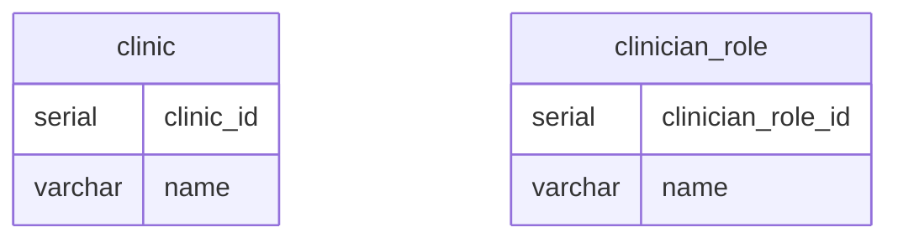

# Device Flow Playground

To run the playground locally, simply serve the root directory:

```sh
npx serve
```


```mermaid
erDiagram

  clinic {
    serial clinic_id
    varchar name
  }

  clinician_role {
    serial clinician_role_id
    varchar name
  }


```
